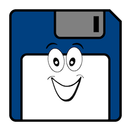

# Gammasoft aims to make C++ fun again.

## Gammasoft is...

* The nickname of [Yves Fiumefreddo](https://about.me/yves.fiumefreddo).
* More than thirty years of passion for high technology especially in development (C++, C#, objective-c, ...).
* Object-oriented programming is more than a mindset.

## ... also

* The C++ is my favorite language, naturaly followed by C#.
* I like Apple products for their simplicity of use but I also admire the technologies of Microsoft for their efficiency as for example the .Net Framework.
* The name Gammasoft was created by analogy with Microsoft. I know... but I was young at this time.

## See also

* [website](https://gammasoft71.github.io)
* [github](https://github.com/gammasoft71)
* [projects](https://sourceforge.net/u/gammasoft71/profile/)
